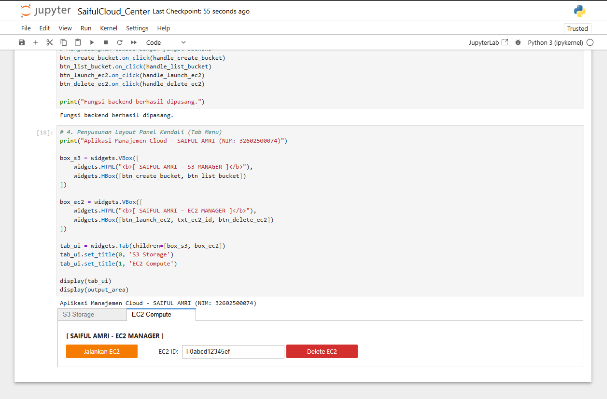
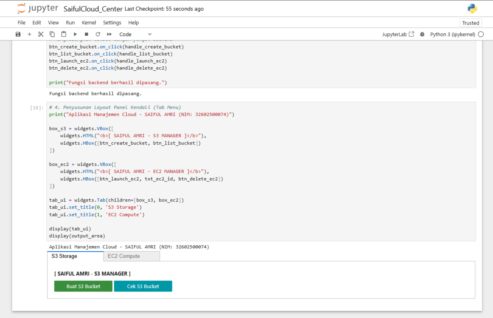

# ☁️ SaifulCloud Center

> Aplikasi Manajemen Cloud AWS (Amazon EC2 & Amazon S3) berbasis Python + Jupyter Notebook

---

## 🚀 Overview

**SaifulCloud Center** adalah aplikasi sederhana berbasis Python yang digunakan untuk mengelola layanan cloud AWS, khususnya:

- ⚡ Amazon EC2 (Compute)
- 🗂️ Amazon S3 (Storage)

Aplikasi ini dibuat menggunakan **Jupyter Notebook** dengan integrasi AWS SDK (Boto3).

---

## 🎯 Tujuan Project

- Memahami konsep Cloud Computing  
- Mengimplementasikan AWS menggunakan Python  
- Mengelola EC2 & S3 secara sederhana  

---

## 🧰 Teknologi yang Digunakan

- Python 3  
- AWS EC2  
- AWS S3  
- Boto3  
- Jupyter Notebook  
- ipywidgets  

---

## 📁 Struktur Project

SaifulCloud-Center/  
│  
├── .gitignore                  → File yang diabaikan GitHub  
├── SaifulCloud_Center.ipynb    → Program utama  
├── requirements.txt            → Library Python  
├── manual penggunaan.pdf       → Panduan penggunaan  
├── EC2_Compute_Saiful_amri.png → Tampilan EC2  
├── S3_Bucket_Saiful_amri.png   → Tampilan S3  
└── README.md                   → Dokumentasi  

---

## ▶️ Menjalankan Aplikasi (CMD)

Ikuti langkah berikut menggunakan **Command Prompt (CMD)**:

1. Buka CMD  
2. Masuk ke folder project:

cd path\ke\folder\SaifulCloud-Center  

3. Jalankan Jupyter Notebook:

jupyter notebook  

4. Browser akan terbuka otomatis  
5. Klik file:

SaifulCloud_Center.ipynb  

6. Jalankan semua cell secara berurutan  

---

## ✨ Fitur Aplikasi

### ⚡ EC2 Management
- Launch Instance  
- Stop Instance  
- Terminate Instance  

### 🗂️ S3 Management
- Create Bucket  
- List Bucket  
- Delete Bucket  

---

## 📘 Manual Penggunaan

### 🔹 EC2
1. Pilih menu EC2  
2. Klik Launch Instance  
3. Masukkan konfigurasi  
4. Gunakan Stop / Terminate sesuai kebutuhan  

### 🔹 S3
1. Masukkan nama bucket  
2. Klik Create Bucket  
3. Gunakan List untuk melihat data  
4. Klik Delete untuk menghapus  

---

## 🖥️ Tampilan Aplikasi

### 🔹 EC2

### 🔹 S3

---

## 👤 Author

Saiful Amri 32602500074
cloud computing
Universitas Islam Sultan Agung  

---

## ⭐ Support

⭐ Star jika membantu  
🍴 Fork project  
📢 Share ke teman  

---
