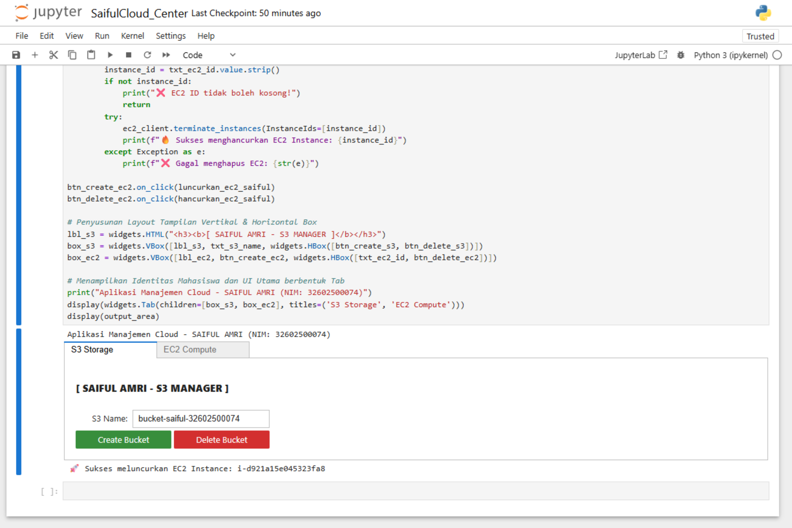

# ☁️ SaifulCloud Center
### Aplikasi Manajemen Cloud AWS (Amazon S3 & Amazon EC2)


---

## 📌 Deskripsi Project

**SaifulCloud Center** merupakan aplikasi sederhana berbasis **Python** yang dijalankan melalui **Jupyter Notebook** untuk melakukan manajemen layanan **Amazon Web Services (AWS)**.

Aplikasi ini memanfaatkan library **Boto3** sebagai AWS SDK untuk Python serta **ipywidgets** untuk membangun antarmuka pengguna (GUI) interaktif di dalam Jupyter Notebook.

Fitur utama aplikasi meliputi:

- ☁️ Manajemen Amazon EC2
- 🪣 Manajemen Amazon S3
- Interface interaktif menggunakan Jupyter Notebook
- Integrasi langsung dengan akun AWS

Project ini dibuat sebagai tugas mata kuliah **Cloud Computing**.

---

# 📂 Struktur Project

```
SaifulCloudCenter/
│
├── SaifulCloud_Center.ipynb      # Notebook utama aplikasi
├── EC2_Compute_Saiful.png        # Screenshot fitur EC2
├── S3_Bucket_Saiful.png          # Screenshot fitur S3
├── manual penggunaan.pdf         # Manual penggunaan aplikasi
├── requirements.txt              # Daftar library
└── README.md                     # Dokumentasi project
```

---

# 🚀 Teknologi yang Digunakan

- Python 3
- AWS Boto3
- Amazon EC2
- Amazon S3
- ipywidgets
- Jupyter Notebook

---

# 📦 Library yang Dibutuhkan

Install seluruh dependency menggunakan:

```bash
pip install -r requirements.txt
```

atau

```bash
pip install boto3 ipywidgets jupyter
```

---

# ⚙️ Konfigurasi AWS

Sebelum menjalankan aplikasi, pastikan AWS Credential telah dikonfigurasi.

## Cara 1 (Direkomendasikan)

Menggunakan AWS CLI

```bash
aws configure
```

Kemudian masukkan:

```
AWS Access Key ID
AWS Secret Access Key
Default Region
Output Format (json)
```

---

## Cara 2

Menggunakan Environment Variables

```
AWS_ACCESS_KEY_ID

AWS_SECRET_ACCESS_KEY
```

---

# ▶️ Menjalankan Project

Masuk ke folder project

```bash
cd path/to/project
```

Jalankan Jupyter Notebook

```bash
jupyter notebook
```

Kemudian buka file

```
SaifulCloud_Center.ipynb
```

Lalu jalankan seluruh cell secara berurutan (**Run All**).

---

# ✨ Fitur Aplikasi

## 1. Amazon EC2 Management

Menu ini digunakan untuk melakukan manajemen instance EC2.

### Fitur

- Launch EC2 Instance
- Delete / Terminate EC2 Instance

User hanya perlu memasukkan Instance ID untuk melakukan proses penghapusan instance.

---

## Tampilan EC2

> Simpan gambar berikut dengan nama:

```
EC2_Compute_Saiful.png
```

Lalu GitHub akan otomatis menampilkannya.

```markdown

```

---

## 2. Amazon S3 Management

Menu ini digunakan untuk melakukan manajemen Bucket Amazon S3.

### Fitur

- Create Bucket
- Delete Bucket

Pengguna cukup memasukkan nama bucket kemudian memilih aksi yang diinginkan.

---

## Tampilan S3

> Simpan gambar berikut dengan nama:

```
S3_Bucket_Saiful.png
```

Kemudian tampilkan menggunakan

```markdown

```

---

# 📖 Manual Penggunaan

## Persiapan

Pastikan telah menginstall:

- Python
- Jupyter Notebook
- Boto3
- ipywidgets

Kemudian lakukan konfigurasi AWS Credential.

---

## Menjalankan Aplikasi

1. Buka Terminal / CMD
2. Masuk ke folder project

```bash
cd path/to/project
```

3. Jalankan

```bash
jupyter notebook
```

4. Buka

```
SaifulCloud_Center.ipynb
```

5. Jalankan seluruh cell secara berurutan.

---

# 💻 Cara Menggunakan

## EC2

### Launch Instance

Klik tombol

```
Launch EC2
```

Maka aplikasi akan membuat instance baru pada AWS.

---

### Delete Instance

Masukkan

```
Instance ID
```

Kemudian klik

```
Delete EC2
```

Instance akan dihapus (Terminate).

---

## Amazon S3

### Create Bucket

Masukkan

```
Nama Bucket
```

Contoh

```
bucket-saiful-32602500074
```

Klik

```
Create Bucket
```

Bucket akan dibuat.

---

### Delete Bucket

Masukkan nama bucket

Klik

```
Delete Bucket
```

Bucket akan dihapus.

---

# 📷 Hasil Pengujian

Aplikasi berhasil melakukan:

✅ Launch EC2 Instance

✅ Terminate EC2 Instance

✅ Create S3 Bucket

✅ Delete S3 Bucket

melalui antarmuka berbasis Jupyter Notebook menggunakan AWS SDK (Boto3).

---

# 📁 File Project

| File | Keterangan |
|-------|------------|
| SaifulCloud_Center.ipynb | Notebook utama |
| requirements.txt | Library yang dibutuhkan |
| manual penggunaan.pdf | Dokumentasi penggunaan |
| EC2_Compute_Saiful.png | Screenshot EC2 |
| S3_Bucket_Saiful.png | Screenshot S3 |
| README.md | Dokumentasi GitHub |

---

# 🎯 Tujuan Project

Project ini dibuat untuk memenuhi tugas mata kuliah **Cloud Computing** dengan mengimplementasikan layanan cloud AWS menggunakan Python.

Implementasi meliputi:

- Amazon EC2
- Amazon S3
- AWS SDK (Boto3)
- Jupyter Notebook
- GUI menggunakan ipywidgets

---

# 👨‍💻 Author

**Saiful Amri**

NIM : **32602500074**

Program Studi Teknik Informatika

Universitas Islam Sultan Agung Semarang

---

# 📄 License

Project ini dibuat untuk keperluan akademik dan pembelajaran.
